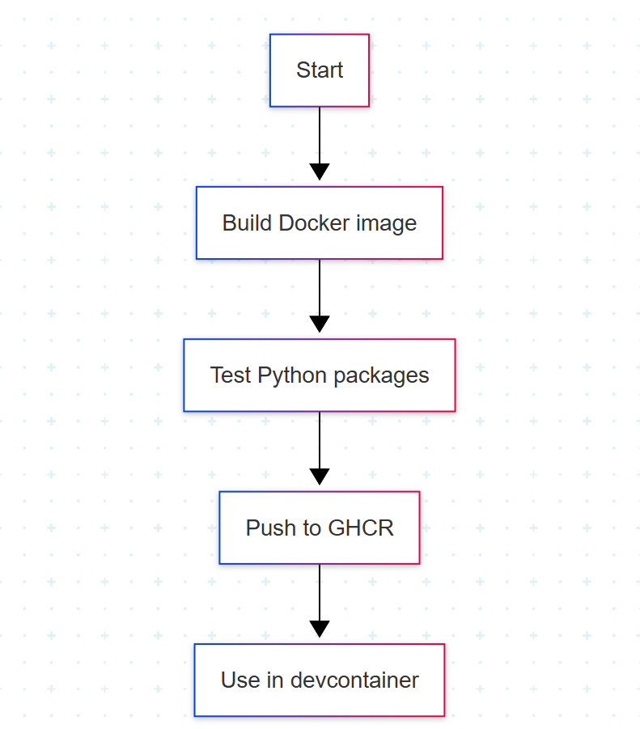

# Raport z projektu - SJU

## Etapy realizacji

- Konfiguracja pliku `Dockerfile`  
- Instalacja wymaganych bibliotek Python  
- Przygotowanie środowiska developerskiego w `devcontainer.json`  
- Testowanie obrazu Dockera lokalnie i z GitHub Actions  
- Tworzenie prezentacji MARP  

---

# Dockerfile

## Instalacja pakietów Python z pliku requirements.txt

- qiskit
- matplotlib
- pillow
- pycryptodomex
- cryptography

---
# Devcontainer

## Konfiguracja pliku `.devcontainer/devcontainer.json`

- Montuje lokalny projekt do /home/vscode/workspace w kontenerze
- Używa obrazu Dockera z GHCR: ghcr.io/spkwap/projekt-sju:latest
- Ustawia domyślną ścieżkę roboczą i użytkownika vscode
- Automatycznie instaluje rozszerzenia VS Code do Pythona
- Po starcie kontenera instaluje zależności z requirements.txt

---

# GitHub Actions

## Budowa i testowanie obrazu

- Ustawia środowisko Dockera
- Buduje obraz Dockera z bieżącego katalogu jako sjuprojekt
- Uruchamia testy w kontenerze (sprawdzenie importów pakietów)
---

# Diagram przepływu pracy

    

--- 
# Praca z notatnikiem Jupyter

- Został pobrany plik z platformy przedmiotu KST
- Przetestowano funkcje Qiskit i matplotlib
- Uruchomiony notatnik działa w kontenerze

---
# Podsumowanie

 

Co było trudne:
- Konfiguracja GitHub Actions

Czego się nauczyłam:
- Konfiguracja środowiska Docker Desktop z Visual Studio Code
- Konteneryzacja
- Praca z devcontainer
- Praca z Github Actions

 
